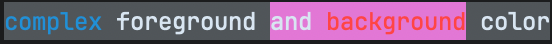

# @xeraph-dev/colors

## Installation

```shell
npm install @xeraph-dev/colors
```

```shell
pnpm add @xeraph-dev/colors
```

```shell
yarn add @xeraph-dev/colors
```

```shell
bun add @xeraph-dev/colors
```


## Usage

### Global

> Works in the **browser**, **esm files** (.mjs) and  **commonjs files** (.cjs)

```javascript
import '@xeraph-dev/colors/global'

// Automatically inserted, no need to use it
console.log('Hello World!'.reset)

// Modifiers
console.log('Hello World!'.bright)
console.log('Hello World!'.dim)
console.log('Hello World!'.underscore)
console.log('Hello World!'.reverse)
console.log('Hello World!'.hidden)

// Foreground colors
console.log('Hellow World!'.black)
console.log('Hello World!'.red)
console.log('Hello World!'.green)
console.log('Hello World!'.yellow)
console.log('Hello World!'.blue)
console.log('Hello World!'.magenta)
console.log('Hello World!'.cyan)
console.log('Hello World!'.white)
console.log('Hello World!'.gray)

// Background colors
console.log('Hello World!'.bgblack)
console.log('Hello World!'.bgred)
console.log('Hello World!'.bggreen)
console.log('Hello World!'.bgyellow)
console.log('Hello World!'.bgblue)
console.log('Hello World!'.bgmagenta)
console.log('Hello World!'.bgcyan)
console.log('Hello World!'.bgwhite)
console.log('Hello World!'.bggray)

// Modifier + color
console.log('Hello World!'.dim.red')
```

### Functions

> Works in **esm files** (.mjs) and  **commonjs files** (.cjs)

```javascript
import { 
  reset, bright, dim, underscore, reverse, hidden,
  black, red, green, yellow, blue, magenta, cyan, white, gray,
  bgblack, bgred, bggreen, bgyellow, bgblue, bgmagenta, bgcyan, bgwhite, bggray, red
} from '@xeraph-dev/colors'

// Automatically inserted, no need to use it
console.log(reset('Hello World!'))

// Modifiers
console.log(bright('Hello World!'))
console.log(dim('Hello World!'))
console.log(underscore('Hello World!'))
console.log(reverse('Hello World!'))
console.log(hidden('Hello World!'))

// Foreground colors
console.log(black('Hellow World!'))
console.log(red('Hello World!'))
console.log(green('Hello World!'))
console.log(yellow('Hello World!'))
console.log(blue('Hello World!'))
console.log(magenta('Hello World!'))
console.log(cyan('Hello World!'))
console.log(white('Hello World!'))
console.log(gray('Hello World!'))

// Background colors
console.log(bgblack('Hello World!'))
console.log(bgred('Hello World!'))
console.log(bggreen('Hello World!'))
console.log(bgyellow('Hello World!'))
console.log(bgblue('Hello World!'))
console.log(bgmagenta('Hello World!'))
console.log(bgcyan('Hello World!'))
console.log(bgwhite('Hello World!'))
console.log(bggray('Hello World!'))

// Modifier + color
console.log(red(dim('Hello World!')))
```

### Constants

> Works in **esm files** (.mjs) and  **commonjs files** (.cjs)

```javascript
import {
  RESET, BRIGHT, DIM, UNDERSCORE, REVERSE, HIDDEN,
  BLACK, RED, GREEN, YELLOW, BLUE, MAGENTA, CYAN, WHITE, GRAY,
  BGBLACK, BGRED, BGGREEN, BGYELLOW, BGBLUE, BGMAGENTA, BGCYAN, BGWHITE, BGGRAY
} from '@xeraph-dev/colors'

// Automatically inserted, no need to use it
console.log(`Hello World!${RESET}`)

// Modifiers
console.log(`${BRIGHT}Hello World!${RESET}`)
console.log(`${DIM}Hello World!${RESET}`)
console.log(`${UNDERSCORE}Hello World!${RESET}`)
console.log(`${REVERSE}Hello World!${RESET}`)
console.log(`${HIDDEN}Hello World!${RESET}`)

// Foreground colors
console.log(`${BLACK}Hellow World!${RESET}`)
console.log(`${RED}Hello World!${RESET}`)
console.log(`${GREEN}Hello World!${RESET}`)
console.log(`${YELLOW}Hello World!${RESET}`)
console.log(`${BLUE}Hello World!${RESET}`)
console.log(`${MAGENTA}Hello World!${RESET}`)
console.log(`${CYAN}Hello World!${RESET}`)
console.log(`${WHITE}Hello World!${RESET}`)
console.log(`${GRAY}Hello World!${RESET}`)

// Background colors
console.log(`${BGBLACK}Hello World!${RESET}`)
console.log(`${BGRED}Hello World!${RESET}`)
console.log(`${BGGREEN}Hello World!${RESET}`)
console.log(`${BGYELLOW}Hello World!${RESET}`)
console.log(`${BGBLUE}Hello World!${RESET}`)
console.log(`${BGMAGENTA}Hello World!${RESET}`)
console.log(`${BGCYAN}Hello World!${RESET}`)
console.log(`${BGWHITE}Hello World!${RESET}`)
console.log(`${BGGRAY}Hello World!${RESET}`)

// Modifier + color
console.log(`${RED}${DIM}Hello World!${RESET}${RESET}`)
```

### Complex usage

```javascript
import '@xeraph-dev/colors/global'

console.log(`${'complex'.blue} foreground ${`and ${'background'.red}`.bgmagenta} color`.bggray)
```



## TypeScript

Set `moduleResolution` in `tsconfig.json` to `Node16`, `NodeNext` or `Bundler`